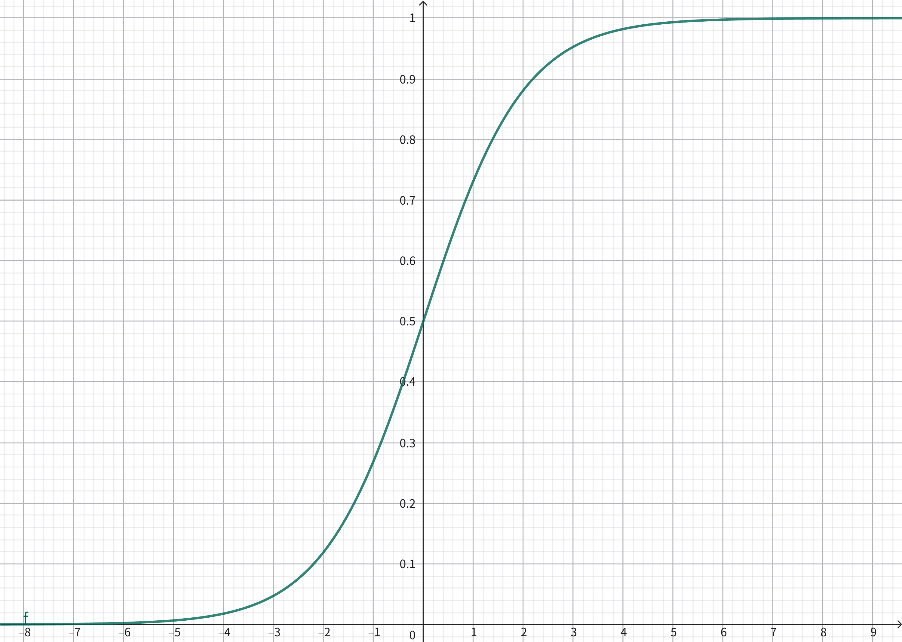
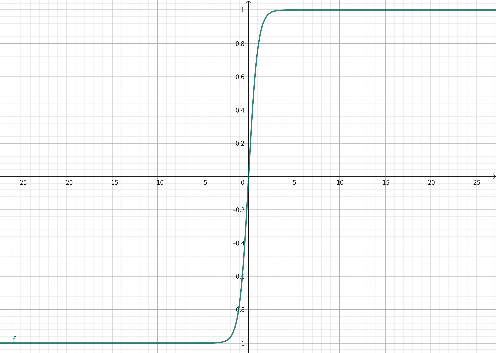

# 神经网络

## 1. 感知机入门

### 1.1 单层感知机

#### 神经元

**神经元 Neuron**是一个一维多元函数$N:\mathbb R^n\rightarrow\mathbb R$，通常由**权重函数**$W:\mathbb R^n\rightarrow\mathbb R$和**激活函数**$A:\mathbb R\rightarrow\mathbb R$构成。

常用激活函数：

1. 阈值/阶跃函数：$\mathrm{sgn}(x)=\begin{cases}1,x\gt0\\0,x\le0\end{cases}$；
2. Sigmoid函数：$\mathrm{sigmoid}(x)=\frac1{1+\mathrm{e}^{-x}}$；
3. ReLU函数：$\mathrm{ReLU}(x)=\max(0,x)$；
   1. Leaky ReLU：$\mathrm{LReLU}(x)=\max(ax,x)$，其中$a$取很小值，如0.01；
   2. PReLU：$\mathrm{PReLU}(x)=\max(ax,x)$，其中$a$为可学习的参数；

#### 感知机

**仿射神经元**是最简单的神经元，由仿射变换$W(\boldsymbol x)=\boldsymbol w\cdot\boldsymbol x+b$和激活函数$\mathrm{sgn}(x)$构成。

1. 参数$\boldsymbol w$表示法向量，$b$表示偏移值，确定一个超平面$\boldsymbol w\cdot\boldsymbol x+b=0$；
2. $W(\boldsymbol x)=\boldsymbol w\cdot\boldsymbol x+b$标识了点$\boldsymbol x$沿法向量$\boldsymbol w$和超平面的相对位置；
3. $\mathrm{sgn}(f(\boldsymbol x))$的值标识了点在超平面的某一侧。

**感知机 Perceptron**使用一个仿射神经元，通过点和超平面的位置关系进行二分类。

参数$\boldsymbol w,b$的学习算法：设所求超平面为$\boldsymbol w_0\cdot\boldsymbol x+b_0=0$，学习率$\eta$，则

1. 输入$\boldsymbol x$，$y_0=\boldsymbol w_0\cdot\boldsymbol x+b_0$，真实分类$\mathrm{sgn}(y_0)$；
2. 预测$y=\boldsymbol w\boldsymbol x+ b$，损失$L=\mathrm{sgn}(y_0)-\mathrm{sgn}(y)$的取值只会是$-1,0,1$；
3. 设$\Delta y(\boldsymbol w,b)=(\boldsymbol w_0-\boldsymbol w)\cdot\boldsymbol x+b_0-b$，则$\nabla\Delta y=(-\boldsymbol x, -1)$；
4. 优化目标是纠正分类：
   1. $L>0$时$\Delta y>0$，按负梯度方向修正，$\boldsymbol w'=\boldsymbol w+\eta \boldsymbol x$，$b'=b+\eta$。
   2. $L<0$时$\Delta y<0$，按正梯度方向修正，$\boldsymbol w'=\boldsymbol w-\eta\boldsymbol x$，$b'=b-\eta$。
   3. 等价于$\boldsymbol w'=\boldsymbol w+\eta L\boldsymbol x$，$b'=b+\eta L$。

**感知机收敛定理**，Rosenblatt&Novikoff，1962：给定线性可分数据集，感知机在$\frac{R^2}{\gamma^2}$次迭代内收敛。

1. 数据半径$R$，超平面到最接近的数据点的距离$\gamma$，最优权重单位向量$\boldsymbol w^*$，则$|\boldsymbol w^*\cdot\boldsymbol x|\ge\gamma$；
2. $\boldsymbol w^t$为第$t$次迭代的权重，则有$\boldsymbol w^t=\boldsymbol w^{t-1}+L\boldsymbol x$；
3. $\boldsymbol w^*\cdot\boldsymbol w^t=\boldsymbol w^*\boldsymbol w^{t-1}+L\boldsymbol w^*\boldsymbol x\ge\boldsymbol w^*\cdot\boldsymbol w^{t-1}+\gamma\ge t\gamma$，由柯西不等式得$t\gamma\le\boldsymbol w^*\cdot\boldsymbol w^t\le\|\boldsymbol w^t\|=\|\boldsymbol w^t\|$；
4. $\|\boldsymbol w^t\|^2=\|\boldsymbol w^{t-1}+L\boldsymbol x\|^2=\|\boldsymbol w^{t-1}\|^2+L^2\|\boldsymbol x\|^2+2L\boldsymbol w^{t-1}\cdot\boldsymbol x$，其中$L^2\|x\|^2\le R^2$，$2L\boldsymbol w^{t-1}\boldsymbol x\le0$，于是$\|\boldsymbol w^t\|^2\le\|\boldsymbol w^{t-1}\|^2+R^2\le tR^2$；
5. $t\gamma\le\|\boldsymbol w^{t}\|\le\sqrt{t}R$，于是$t\le\frac{R^2}{\gamma^2}$。

#### 单层感知机

根据多个感知机对同一向量的输出，可进行多分类，称为**单层感知机**：

1. 单层感知机$P:\mathbb R^n\rightarrow\mathbb R^m$有$m$个感知机，输入$n$维向量进入所有感知机并各自生成$1$维输出；
2. 单层感知机$P:\mathbb R^n\rightarrow\mathbb R^m$的权重函数是矩阵$\boldsymbol W_{m\times n}$，$P(\boldsymbol x)=\mathrm{Act}(\boldsymbol W\boldsymbol x)$，其中$\mathrm{Act}$为激活函数；
3. 单层感知机通过点和多个超平面的位置关系进行多分类，只能解决线性可分问题。

### 1.2 多层感知机

#### 多层感知机

串联多个单层感知机，前一个感知机的输出作为后一个感知机的输入，称为**多层感知机**：

1. 串联$P_{m\times n}:\mathbb R^m\rightarrow\mathbb R^n$和$P_{n\times p}:\mathbb R^n\rightarrow\mathbb R^p$形成双层感知机，其中$P_{n\times p}$称为**输出层**，$P_{m\times n}$称为**隐藏层**。
2. $P_{m\times n}$接受$m$维输入，将$n$维输出传递给$P_{n\times p}$，最终产生$p$维输出；
3. 多层感知机中，每层神经元和下层神经元相连，不存在同层连接和跨层连接，称为**前馈神经网络**；

双层感知机，激活函数记为$f$：

1. 训练集$X=\{\boldsymbol x_1,\dots,\boldsymbol x_m\},\boldsymbol x_i\in\mathbb R^d$，标记集$Y=\{\boldsymbol y_1,\dots,\boldsymbol y_m\},\boldsymbol y_i\in\mathbb R^l$；
2. 隐藏层$H_{d\times q}$，权重矩阵$\boldsymbol V_{q\times d}$，阈值向量$\boldsymbol h_q$，$H(\boldsymbol x)=\boldsymbol f(\boldsymbol V\boldsymbol x-\boldsymbol h)$；
3. 隐藏层输出记为$\boldsymbol b$，第$i$维输出$b_i=f(\sum_{k=1}^d(v_{ik}x_k-h_k))$；
4. 输出层$O_{q\times l}$，权重矩阵$\boldsymbol W_{l\times q}$，阈值向量$\boldsymbol o_l$，$O(\boldsymbol b)=\boldsymbol f(\boldsymbol W\boldsymbol b-\boldsymbol o)$；
5. 预测输出记为$\hat{\boldsymbol y}$，第$i$维输出$\hat y_i=f(\sum_{k=1}^q(w_{ik}b_k-o_k))$。

#### 反向传播

**反向传播 BackPropagation**是最常用的多层网络学习算法。

双层感知机，使用$\mathrm{sigmoid}$激活函数，记为$f$，有$f'=f(1-f)$。

1. 给定训练集$X=\{\boldsymbol x_1,\dots,\boldsymbol x_m\},\boldsymbol x_i\in\mathbb R^d$，标记集$Y=\{\boldsymbol y_1,\dots,\boldsymbol y_m\},\boldsymbol y_i\in\mathbb R^l$；
2. 隐藏层$H_{d\times q}$，权重矩阵$\boldsymbol V_{q\times d}$，阈值向量$\boldsymbol h_q$，$H(\boldsymbol x)=\boldsymbol f(\boldsymbol V\boldsymbol x-\boldsymbol h)$；
3. 隐藏层输出记为$\boldsymbol b$，第$i$维输出$b_i=f(\sum_{k=1}^d(v_{ik}x_k-h_k))$；
4. 输出层$O_{q\times l}$，权重矩阵$\boldsymbol W_{l\times q}$，阈值向量$\boldsymbol o_l$，$O(\boldsymbol b)=\boldsymbol f(\boldsymbol W\boldsymbol b-\boldsymbol o)$；
5. 预测输出记为$\hat{\boldsymbol y}$，第$i$维输出$\hat y_i=f(\sum_{k=1}^q(w_{ik}b_k-o_k))$。

反向传播，学习率$\eta$，更新$\boldsymbol V,\boldsymbol W,\boldsymbol h,\boldsymbol o$：

1. 损失函数$E=\frac12\sum_{i=1}^n(y_i-\hat y_i)^2$；
1. 输出层第$j$维输入到第$i$维输出的权重$w_{ij}$，阈值$o_i$，由负梯度更新，$\Delta w_{ij}=-\eta\frac{\partial E}{\partial w_{ij}}$，$\Delta o_i=-\eta\frac{\partial E}{\partial o_i}$；
1. $\frac{\partial E}{\partial w_{ij}}=\frac{\partial E}{\partial \hat y_i}\frac{\partial \hat y_i}{\partial w_{ij}}=-(y_i-\hat y_i)\hat y_i(1-\hat y_i)b_j$，$\frac{\partial E}{\partial o_i}=\frac{\partial E}{\partial\hat y_i}\frac{\partial\hat y_i}{\partial o_i}=(y_i-\hat y_i)\hat y_i(1-\hat y_i)$；
1. 记$g_i=(y_i-\hat y_i)\hat y_i(1-\hat y_i)$，则$\Delta o_i=-\eta g_i$，$\Delta w_{ij}=\eta g_ib_j$。
1. 隐藏层第$j$维输入到第$i$维输出的权重$v_{ij}$，阈值$h_i$，$\Delta v_{ij}=-\eta\frac{\partial E}{\partial v_{ij}}$，$\Delta h_i=-\eta\frac{\partial E}{\partial h_i}$；
1. $\frac{\partial E}{\partial v_{ij}}=\sum_{k=1}^l\frac{\partial E}{\partial\hat y_k}\frac{\partial\hat y_k}{\partial b_i}\frac{\partial b_i}{\partial v_{ij}}=\sum_{k=1}^l(g_kw_{ki}b_i(1-b_i)x_j)$，$\frac{\partial E}{\partial h_i}=-\sum_{k=1}^l(g_kw_{ki}b_i(1-b_i))$；
1. 记$e_i=b_i(1-b_i)\sum_{k=1}^lg_kw_{ki}$，则$\Delta h_i=-\eta e_i$，$\Delta v_{ij}=\eta e_ix_j$。

### 1.3 算法优化

#### 局部最优

反向传播算法基于梯度下降寻找极值点，学习过程中，模型可能陷入局部极值点，而无法发现全局最值，通常采用下述策略避免：

1. 以不同参数初始化多组多层感知机，训练后取其中损失最小的；
2. 模拟退火，每一步以一定概率接受比当前解更差的结果，该概率逐渐降低；
3. 随机梯度下降，在计算梯度时加入随机因素。

#### 初始权重

sigmoid函数在输入偏大时发生“饱和”，即梯度趋于0，使得学习效果差。

1. 带权输入服从$N(0,1)$时，Sigmoid的效果较好；
2. 假设单层有$n$个节点，当单个权值服从$N(0,x)$，总的带权输入服从$N(0,nx)$，于是单权值应服从$N(0,\frac1n)$。

#### 批量训练

每次学习单样本，噪声敏感，更新频率高；

累计计算批量样本的误差和再更新，收敛快，容易陷入局部极小，计算代价大。

大批量数据可采用小批量训练+随机梯度下降。

## 2. 前馈神经网络

由层内不连接、邻层间互连的多层神经元组成的网状结构称为**前馈神经网络**。

1. 双层感知机是双层前馈神经网络，隐藏层大于1层的前馈神经网络称为**深度神经网络**；
2. 前馈神经网络的神经元$y=f(\boldsymbol x)=a(\boldsymbol w\boldsymbol x+b)$由**仿射函数**$y=\boldsymbol w\boldsymbol x+b$和**激活函数**$a$组成。

### 2.1 模型

#### 激活函数

激活函数$a(x)$，当$\lim_{x\rightarrow-\infty}a'(x)=0$，称为**左饱和**；当$\lim_{x\rightarrow+\infty}a'(x)=0$，称为**右饱和**，既左饱和又右饱和，则称为**饱和激活函数**。

隐藏层常用的激活函数有sigmoid函数、双曲正切函数、ReLU函数。

**sigmoid函数**$s(x)=\frac1{1+e^{-x}}$又称logistic函数。

1. sigmoid函数映射$\mathbb R$到$(-1,1)$，在0附近近似线性递增，$s(0)=0.5$；
2. $s'(x)=s(x)(1-s(x))$。

**双曲正切函数**$\tanh(x)=\frac{e^x-e^{-x}}{e^x+e^{-x}}=2\mathrm{sigmoid}(x)-1$。

1. tanh函数映射$\mathbb R$到$(-1,1)$，在0附近近似线性递增，$\tanh(0)=0$；
2. $\tanh'(x)=1-\tanh^2(x)$。

**整流线性函数**（rectified linear unit，ReLU）$\mathrm{relu}(x)=\max(0,x)$。

1. $\mathrm{relu}'(x)=\begin{cases}1,x\gt0\\0,x\le0\end{cases}$；
2. ReLU函数计算效率更高，广泛使用。

输出层常用的激活函数有恒等函数、sigmoid函数、SoftMax函数。

1. 恒等函数用于回归；
2. sigmoid函数用于二分类；
3. SoftMax函数用于多分类。

**SoftMax函数**$a(\boldsymbol x)=(\frac{\mathrm{e}^{x_1}}{\sum_{i=1}^l\mathrm e^{x_i}},\dots,\frac{\mathrm{e}^{x_l}}{\sum_{i=1}^l\mathrm e^{x_i}})$是对$\max$函数的近似。$\frac{\partial y_k}{\partial x_j}=\begin{cases}y_k(1-y_k),j=k\\-y_ky_j,j\ne k\end{cases}$。

