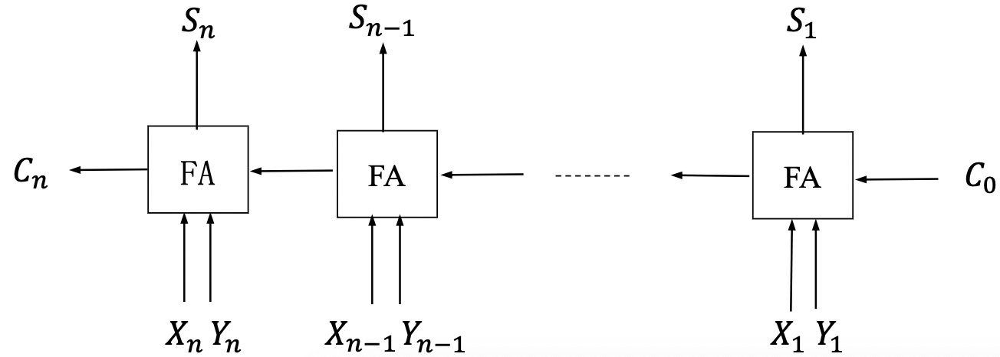

# COAFull


## 1. 计算机系统概述

1. 冯·诺伊曼结构：存储程序计算机

   - 思想：将数据和程序存储在存储器中。

   - 三个基本原则：二进制、存储程序、5个组成部分

     5个组成部分：

     1. 主存储器
     2. 算术逻辑单元
     3. 控制单元
     4. 输入设备
     5. 输出设备

2. 计算机系统：分为硬件系统和软件系统。

   - 硬件：5个组成部分
   - 软件：系统软件和应用软件
     - 三种语言：机器语言、汇编语言、高级语言
     - 三种翻译程序：
       - 汇编器（汇编$\rightarrow$机器）
       - 解释器（顺序逐条翻译为机器语言）
       - 编译器（高级$\rightarrow$机器/汇编）
   - 软硬件的逻辑等价性：一项功能既可以纯硬件实现，也可以硬件+软件扩充实现。

3. 计算机性能指标：

   - 机器字长：计算机进行一次整型运算能够处理的二进制数据位数。
   - 数据通路带宽：数据总线一次所能并行传送信息的位数。
   - 主存容量
     - 内存地址存储器，MAR的位数反映了存储单元的个数
     - 内存数据存储器，MDR的位数反映了存储单元的字长
   - 运算速度
     - CPU时钟周期：CPU工作最小的时间单位，机器决定
     - 主频：时钟周期的倒数，即每秒的时钟周期数
     - CPI，Cycle Per Instruction：执行一条指令需要的时钟周期数
     - IPS，Instruction Per Second：每秒执行指令数，IPS=主频/平均CPI。
     - CPU执行时间：一个程序执行的时间。CPU执行时间=程序执行的CPU时钟周期数/主频。
     - FLOPS，Floating-point Operations Per Second：每秒浮点运算数。
       - M，$10^6$
       - G，$10^9$
       - T，$10^{12}$
       - P，$10^{15}$
       - E，$10^{18}$
       - Z，$10^{21}$
       - 京=亿亿=$10^{16}$

4. 术语：

   - 固件：存储在ROM中的程序部件。


## 2. 数据的表示和运算

### 表示

1. 进制转换：

   - 二进制$\rightarrow$八/十六进制：二进制数每3位组成一个八进制数，每四位组成一个十六进制数。
   - $k$进制$\rightarrow$十进制：$k$进制数$a_n...a_0.a_{-1}...a_{-m}=a_n\times k^n+...+a_0\times k^0+a_{-1}\times k^{-1}+...+a_{-m}\times k^{-m}$
   - 十进制$\rightarrow$$k$进制：基数乘除法
     - 整数部分除k取余数，先取得的余数为低位，商为0时结束
     - 小数部分乘k取整数，先取得的整数为高位，乘积为1.0时结束。
2. 整数的二进制机器表示：数的二进制编码称为机器数，机器数的实际值称为真值。

   - 原码：最高位表示正负，其余为数的绝对值。
   - 反码：正数与原码相同，负数为绝对值原码取反。
   - 补码：正数与原码相同，负数为$2^{字长}+本身$（绝对值原码取反后+1）
   - 移码：在真值上加上一个常数，通常为$2^{字长-1}$，以该值的原码保存
3. 浮点数的二进制机器表示：

   - 科学计数法：符号、尾数/有效值、底数、指数/阶码，$N=(-1)^m\times (1.f)\times 2^e$
     - 符号 m：即正负，通常用0表示正，1表示负

     - 指数/阶码 e：往往使用移码存储。

     - 底数：二进制中为2

     - 尾数 1.f：二进制定点小数$1.abcd...$，存储时省略整数位的1。

   - 32位浮点数常用表示：第0位表示符号，1～8位表示阶码，9～31位表示尾数。
     - 表示范围：
       - 阶码范围为$-127\sim128$（偏置值127）
       - 尾数范围为$1\sim2-2^{-23}$
       - 可表示$-(2-2^{-23})\times2^{128}\sim-2^{-127}$和$2^{-127}\sim(2-2^{-23})\times2^{128}$
       - 注意到无法表示$-2^{-127}\sim2^{-127}\rightarrow$非规格化
     - 非规格化：当阶码为-127，视为非规格化数，此时$N=(-1)^m\times(0.f)\times2^{-126}$
     - 规格化：
       - 左规：尾数0.00...时尾数左移，阶码减一；
       - 右规：尾数整数位大于1时尾数右移，阶码加一。
   - IEEE 754标准：
     - 单精度浮点数，32位：1位符号，8位阶码（偏置值127），23位尾数
       - 阶码为128（移码值255）时
         - 尾数小数全为0，则为正/负无穷大
         - 尾数小数不为0，则为非数$NaN$
       - 阶码为-127（移码值0）时
         - 尾数小数全为0，则为0
         - 尾数小数为$f$，移码值为$e$，$N=(-1)^m2^{e-126}(0.f)$
       - 一般情况：$N=(-1)^m2^{e-127}(1.f)$，其中$m$为符号位，$e$为阶码移码值，$f$为尾数小数。
     - 双精度浮点数，64位：1位符号，11位阶码，52位尾数
4. 二进制编码的十进制表示（NBCD）：0000～1001表示0～9，逐位用4个二进制位表示十进制数。
5. 大端存储：高位字节存储在低地址，如01234567H中01H存放在低地址。
6. 边界对齐：地址是自身大小的整数倍，半字地址为2的整数倍，字地址为4的整数倍。
   - C语言struct的边界对齐：
     - 每个成员按其类型的大小对齐。
     - struct的长度为成员中最大对齐值的整数倍。


### 运算

1. 全加器：使用进位$C$、输入位$X$和$Y$计算

   - 结果位：$S=X\oplus Y\oplus C$（$\oplus$表示异或），需要进行两次异或运算的时间
   - 进位：$C'=(X\land C)\lor(X\land Y)\lor(C\land Y)$，需要进行两次与/或运算的时间
     - 设与/或运算的时间为$1\;ty$，则异或运算的时间为$3\;ty$。（异或由与或非组合完成）

   串行进位加法器：串联多个全加器对两个二进制数逐位求和。

   

   - 计算时间：$C_n$需要$2n\;ty$，$S_n$需要$2n+1\;ty$（n为1或2时需要6 ty）。

   全先行进位加法器：提前计算$C_n$。

   - $C_i=X_iC_{i-1}+Y_iC_{i-1}+X_iY_i$，设$P_i=X_i+Y_i,G_i=X_iY_i$。
     - $C_1=G_1+P_1C_0$
     - $C_2=G_2+P_2C_1=G_2+P_2G_1+P_2P_1C_0$
     - $......$
   - 只需用$1\;ty$计算$P_i,G_i$，用$2\;ty$计算$C_i$，再用$3\;ty$计算$S_i$，共$6\;ty$。
   - 缺点：电路复杂。

   部分先行进位加法器：串联多个全先行进位加法器

   - 当有k个全先行进位加法器，计算延迟为$1+2k+3\;ty$。

2. 加法器标志位：

   - 溢出标志$OF=C_n\oplus C_{n-1}$
   - 符号标志$SF$即和的符号
   - 零标志$ZF=1$当且仅当和为0
   - 进位/借位标志$CF=C_{in}\oplus C_n$

3. 补码减法：将$C_0$置为1，并将被减数按位取反后输入加法器。

   - 一个补码整数的负数的补码为其取反再加一。

4. 溢出：

   - 符号位不同则不会溢出。
   - 符号位相同，且相加后符号位变化，则发生溢出。
     - $X_n=Y_n$且$S_n\neq X_n,Y_n$。
     - 使用$C_n\oplus C_{n-1}$计算是否溢出。

5. 整数乘法：逐位求积并对每一位的积求和。

   - 设乘数$X$，被乘数$Y$均为无符号$n$位二进制数，则设$2n$位乘积寄存器，初始全0。

     - 当$Y_i$为0，部分积右移一位。
     - 当$Y_i$为1，部分积前n位加上$X$，并右移一位。

   - 布斯算法：带有符号位的乘法

     $\begin{aligned}X\times Y&=X\times Y_nY_{n-1}...Y_2Y_1\\&=X\times(-Y_n\times2^{n-1}+Y_{n-1}\times(2^{n-1}-2^{n-2})+...+Y_1\times(2-2^0))\\&=X\times((Y_{n-1}-Y_n)\times2^{n-1}+...+(Y_0-Y_1)\times2^0)\\&=2^n\times\Sigma_{i=0}^{n-1}(X\times(Y_i-Y_{i+1})\times2^{-(n-i)}) \end{aligned}$

     - $Y_0=0$
     - 根据$Y_{i},Y_{i+1}$来确定部分积加上$X,-X$或$0$，右移部分积。重复$n$次。

6. 整数除法：

   - 被除数为0，除数不为0：商为0。

   - 被除数不为0，除数为0：异常，除数为0。

   - 被除数、除数均为0：异常，除法错。

   - 被除数、除数均不为0：

     - 补码中正确的补位：左补符号右补零

     - 恢复余数的除法过程：

       1. 在被除数前面加n位符号位扩展至2n位，存储在余数和商寄存器中
       2. 将余数和商左移，判断是否够减（同号相减，异号相加，变号则不够减）
          - 如果够，上商为1；不够，恢复余数，上商为0。
       3. 重复
       4. 如果除数和被除数不同号，则将商替换为其相反数
       5. 余数存在余数寄存器中

     - 不恢复余数的除法过程：

       1. 在被除数前面加n位符号位扩展至2n位，存储在余数和商寄存器中

       2. 若除数与被除数符号相同则作减法，否则作加法，如果余数和除数符号相同，上商为1，否则商为0；

          - 如果余数和除数符号相同，余数$R_{i+1}=2R_i-Y$，否则，$R_{i+1}=2R_i+Y$；

            如果新的余数和除数符号相同，商为1，否则，商为0

       3. 重复。

7. 浮点数加减法：检查0，对齐尾数（放大偏小的阶码），加减有效值，规格化结果。

   - 阶值上溢：正阶值超过可能的最大允许阶值，标记为$+\infin$或$-\infin$。
   - 阶值下溢：负阶值小于可能的最小允许阶值，报告为0。
   - 有效值上溢：同号两个有效值相加导致最高有效值的进位，需重新对齐以修正
   - 有效值下溢：有效值对齐过程中，有数字移出右端最低位而丢失，需四舍五入

   浮点数乘法：检查0，阶值求和并减去一个偏移量，有效值相乘，规格化结果和舍入。

   浮点数除法：检查0，阶值相减并加上一个偏移量，有效值相除，规格化结果和舍入。

   - 溢出只根据阶值来判断。


### 数据校验

1. 基本思想：存储额外的信息以进行检错和校正。

   - 处理过程：

     1. 数据输入：使用函数$f$在$M$位数据$D$上生成$k$位校验码$C$

     2. 数据输出：使用函数$f$在$M$位数据$D'$上生成新的$k$位码$C''$，并与取出的$k$位码$C'$进行比较

        - 未检测到差错：使用数据$D'$

        - 检测到差错并可以校正：校正数据$D'$来生成数据$D''$，并使用数据$D''$

        - 检测到差错但无法纠正

2. 奇偶校验码：增加一位校验码来表示数据中1的数量是奇数还是偶数。

   - 奇校验码：数据中1的数量为奇数则为1，反之为0。

     - 处理过程：数据中每一位进行异或，再与1进行一次异或。

     - 检错：对$C''$和$C'$进行异或。结果为1则出错奇数位，为0则正确或错偶数位。

   - 适用于对较短长度数据进行检错。

     - 优点：只需1位，计算简单，代价低。
     - 缺点：出错位数为偶数不能发现；发现错误无法校正。

3. 海明码：将数据分成几组，对每一组都使用奇偶校验码进行检错。

   - 在$2^i$位置插入校验位$P_i$。
   - 对于插入后的数据，$P_i$为所有编号的二进制第$i$位为1的数的异或。
   - 可能的错误：
     - 数据中有1位错误：将故障字设置为与其故障值相同的位置
     - 校验码中有1位错误：此时故障字中仅1位为1。
     - 没有出现错误：此时故障字均为0

4. 循环冗余校验：

   - 假设数据有M位，左移数据K位，右侧补0，并除以K+1位生成多项式，使用K位余数作为校验码，放在不含补的0的数据后，一同存储或传输。
   - 检错：若M+K内容可被生成多项式除尽，则未检测到错误。否则为发生错误。


## 3. 存储器

1. 存储器：由一定数量的单元构成，每个单元可以被唯一标识，并有存储一个数值的能力。

   - 地址：单元的唯一标识符
   - 地址空间：可唯一标识的单元总数
   - 寻址能力：存储在每个单元中信息的位数
     - 大多数存储器是字节寻址的，而执行科学计算的计算机通常是64位寻址的

   - 位元：半导体存储器的基本元件，用于存储一位数据

2. 读写存储器：

   随机存取存储器，RAM：快速存取，易失

   - 动态RAM，DRAM：使用电容充电的方式存储数据，根据电荷阈值确定1或0。
     - 可存储数据$2^n\times b$位，其中$r$行$c$列，$r\times c=2^n$。
       - 使用行列地址引脚复用技术，因此$|r-c|$应尽量小。
     - 需要周期按行刷新数据存储，因此需满足$r\le c$。
     - 刷新机制：
       - 集中式刷新：停止读写内存并刷新每一行；刷新时无法操作内存
       - 分散式刷新：在每个存储周期内，当读写操作完成时进行刷新
         - 会增加每个存储周期的时间
       - 异步刷新：每一行各自以64ms间隔刷新；效率高，较常用
   - 静态RAM，SRAM：使用传统触发器、逻辑门存储数据。
     - 有电源就可以一直维持数据。
   - 对比：
     - SRAM更快
     - DRAM位元更小，数据密度更高，价格更低
     - DRAM需要支持刷新的电路
     - DRAM常用于主存，SRAM常用于高速缓存
   - 同步DRAM，SDRAM：与处理器的数据交互同步与外部的时钟信号。
   - 双速率SDRAM：每个时钟周期发送两次数据，分别在时钟脉冲的上升沿和下降沿。

3. 主存组织：

   地址总线位数：地址空间位数

   数据总线位数：地址单元位数

   - 位扩展：地址线不变，数据线增加
     - 使用8块4K * 1bit的芯片组成4K * 8bit的存储器

   - 字扩展：地址线增加，数据线不变
     - 使用4个16K * 8bit的芯片组成64K * 8bit的存储器

   - 字、位同时扩展：地址线和数据线都增加
     - 使用8个16K * 4bit的芯片组成64K * 8bit的存储器

   存储芯片访问：片选（选择芯片）、字选（访问存储单元）

   - 片选：
     - 线选法：高位地址线直连芯片，当电位为0时选择该芯片（1位地址决定一个芯片）
     - 译码片选法：高位地址译码器选片（n位地址选择$2^n$个芯片）

4. 多模块存储器：空间并行，利用多个结构相同的存储模块提高存储器的吞吐率。

   - 单体多字存储器：每个存储单元存储多个字，一次并行读出多个字。
   - 多体并行存储器：多个模块独立读写。
     - 高位交叉编址（顺序方式）：顺序在多个存储器上存储
     - 低位交叉编址（交叉方式）：地址模以模块数，在对应模块上存储

5. 只读存储器，ROM：非易失，不需要供电维持；可读但不能写。

   可编程ROM，PROM：可以使用电信号等专门设备写入一次。

   可擦除PROM，EPROM：光擦除，电写入，更贵但能多次改写。

   电EPROM，EEPROM：随时写入。更贵，密度低于EPROM。

   快闪存储器，Flash Memory：电可块级擦除，密度与EPROM相同，价格在EPROM和EEPROM间。

6. 高速缓冲存储器，Cache

   - 内存墙：CPU的速度比内存快，且两者差距不断扩大

   - 程序访问的局部性原理：处理器频繁访问主存中相同位置或者相邻存储位置的现象

     - 时间局部性：在相对较短的时间周期内，重复访问特定的信息
     - 空间局部性：在相对较短的时间内，访问相邻存储位置的数据
       - 顺序局部性：数据被线性排列访问时，出现的一种空间局部性特殊情况

   - 工作流程：

     当CPU试图访问主存中的某个字时，首先检查这个字是否在Cache中。

     - 命中：在Cache中，把这个字返回给CPU

     - 未命中：不在Cache中，将包含这个字的主存中的固定大小的块读入Cache，再从Cache中将字传输给CPU

   - 时间计算：命中率$p$，Cache访问时间$T_C$，主存访问时间$T_M$，平均访问时间$T_A$

     - $T_A=T_C+(1-p)T_M$
     - $p$越大，$T_C$越小，效果越好。
     - $T_A\lt T_M$的条件是$p\gt \frac{T_C}{T_M}$
     - Cache增大使得$p$增大，但$T_C$也增加

   - 主存和Cache映射：假设Cache有$2^c$行，主存$2^m$块。

     - 直接映射：主存中每一块映射到固定的Cache行，主存地址高$m-c$位作为标记。

       - 主存第$j$块映射到第$i$行：$i=j\;mod\;2^c$
       - 即主存地址由$m-c$位标记，$c$位行号和块内地址组成。
         - 查找时，先根据行号查Cache，然后比对标记。
       - 缺点：抖动现象（Thrashing），程序重复访问两个需要映射到同一行中且来自不同块的字，则这两个块不断被交换到Cache中导致命中率下降

     - 关联映射：一个主存块可以装入Cache任意一行

       - 将块装入空行，满之后根据特定算法进行替换。
       - 缺点：搜索需要遍历每一行，适合小容量Cache

     - 组关联映射：Cache分为多个组，主存块装入固定组的任意行

       - 假设有$2^s$组，则主存地址前$m-s$位为标记，接下来$s$位为组号
       - $k=c-s$，又称$2^k$路组关联映射。

     - 替换算法：随机 RAND，先进先出 FIFO，近期最少使用 LRU，最不经常使用 LFU

       - LRU：

         假设：最近使用过的内存块更可能被再次使用

         策略：替换掉Cache中最长时间未被访问的内存块

         实现：2路组关联映射

         1. 每行包含一个USE位
         2. 在同一组中的行被访问时，将其USE值设为1，将另一行的USE位设为0
         3. 新数据块读入时，替换USE值为0的数据块

         4路组关联映射

         1. 每行包含两个USE位
         2. 在同一组中的行被访问时，将其USE值清0，其余非空行的USE值+1。
         3. 新数据块读入时，替换USE值最大的数据块

       - LFU：

         假设：访问越频繁的数据块越有可能被再次使用

         策略：替换掉Cache中被访问次数最少的数据块

         实现：为每一行设置计数器

   - Cache写策略

     - 写直达：所有写操作同时对Cache和主存进行

       - 优点：确保主存中数据总是和Cache中一致
       - 缺点：产生大量主存访问，减慢写的操作

     - 写回法：

     - 写回法：先更新Cache，被替换时，若修改则写回主存

       - 利用一个使用位表示块是否被修改

       - 优点：减少了访问主存的次数
       - 缺点：部分主存数据可能不是最新的

7. 外部存储器：用于存储不经常使用的、数据量较大的信息；非易失

   磁盘：由涂有可磁化材料的非磁性材料构成的圆形盘片，分为软磁盘和硬磁盘

   - 硬盘结构：
     - 磁盘驱动器：驱动磁盘转动并在盘面上通过磁头进行读写
     - 磁盘控制器：磁盘驱动器和主机的接口
     - 存储区：多个盘片
       - 每个盘片有两个盘面，每个盘面有一个读写磁头。
       - 盘面上有多个同心圆结构的磁道，相邻磁道间存在间隙。
       - 磁道分为多个扇区，相邻扇区间存在间隙，相邻多个扇区组合成簇，按簇读写。
       - 不同盘片相同位置的磁道构成柱面。
   - 记录密度：
     - 道密度：沿磁盘半径方向单位长度上的磁道数
     - 位密度：磁道单位长度上的位数
     - 面密度：盘面单位面积上的位数，位密度和道密度的乘积
   - 磁盘容量：
     - 非格式化容量：可用磁化单元总数，记录面数$\times$柱面数$\times$每条磁道的磁化单元数
     - 格式化容量：按某种特定格式能容纳的量，记录面数$\times$柱面数$\times$每道扇区数$\times$每扇区容量
   - 存取时间：寻道时间+旋转延迟+传输时间
     - 寻道时间：磁头定位到指定磁道的时间。
       - 寻道算法：
         - 先来先服务 FCFS
         - 最短寻道时间优先 SSTF
         - 扫描/电梯 SCAN：磁头按照一个方向移动到边缘，然后返回
         - 循环扫描 CSCAN：磁头只在往一个方向移动时进行读写，返回时不处理
         - 电梯 LOOK：SCAN时，如果方向上没有请求就返回
         - 循环电梯 CLOOK：CSCAN时，如果方向上没有请求就返回
     - 旋转延迟：等待响应扇区的起始处到达磁头所需的时间。
       - 通常使用平均旋转延迟（旋转半周的时间）进行计算
     - 传输时间：数据传输速率$rN$，其中磁盘转速$r$转每秒，每条磁道容量$N$字节。
       - 需要传输$b$字节，则传输时间$\frac{b}{rN}$。
   - 磁盘地址：柱面（磁道）号，盘面号，扇区号。

8. U盘：采用了快闪存储器，属于非易失性半导体存储器

   - 相比于软盘和光盘：体积小、容量大、便携、寿命长

   固态硬盘 SSD：与U盘本质相同，容量更大，存储性能更好

   - 与硬磁盘存储器相比：抗振性好、无噪声、能耗低、发热少
   - 磨损均衡：闪存的擦写次数有限，如果集中在几个闪存块进行读写，会导致其磨损较快
     - 动态磨损均衡：写入时自动选择较新的闪存块
     - 静态磨损均衡：SSD自动检测并进行数据分配，使得平时的读写在较新的闪存块进行

9. 冗余磁盘阵列 RAID：

   - RAID0：无冗余、无校验磁盘阵列，通过多个磁盘进行存储提高读写速度
   - RAID1：镜像磁盘阵列，通过磁盘镜像提高安全性
   - RAID2：海明码磁盘阵列
   - RAID3：位交叉奇偶校验磁盘阵列
   - RAID4：块交叉奇偶校验磁盘阵列
   - RAID5：无独立校验的奇偶校验磁盘阵列


## 4. 指令系统和处理器

1. 指令：计算机执行某种操作的命令。

   指令集：一台计算机所有指令的集合，也称指令系统。

   指令集架构，ISA：

   - 指令格式
   - 操作数类型，操作数寻址方式和存储方式
   - 可访问的寄存器，存储空间的大小和编址
   - 指令执行的控制方式

   指令操作类型：

   - 数据传送
   - 算术和逻辑运算
   - 跳转、调用指令
   - 输入/输出指令

2. 寻址方式：

   - 指令寻址：
     - 顺序寻址：PC加1
     - 跳跃寻址：转移类指令，修改PC值
   - 数据寻址：
     - 隐含寻址：操作数地址为固定的寄存器
     - 立即寻址：指令中给出操作数本身
     - 直接寻址：指令给出操作数真实地址
     - 间接寻址：指令给出地址的主存单元存储了操作数地址
     - 寄存器寻址：指令给出操作数所在寄存器
     - 寄存器间接寻址：指令给出寄存器，寄存器中为操作数所在主存单元地址
     - 相对寻址：常用于转移指令，指令给出的形式地址值加上PC值形成有效地址
     - 基址寻址：基址寄存器中内容加上指令给出的形式地址形成有效地址，面向OS
     - 变址寻址：变址寄存器中内容加上指令给出的形式地址形成有效地址，面向用户
     - 堆栈寻址：隐含使用堆栈中值作为地址

3. x86汇编：

   - 寄存器：x86处理器中有8个32位的通用寄存器

     - EAX：累加器，低16位为AX
     - EBX：基地址寄存器，低16位为BX
     - ECX：计数寄存器，低16位为CX
     - EDX：数据寄存器，低16位为DX
     - ESI、EDI：变址寄存器
     - EBP：堆栈基指针
     - ESP：堆栈顶指针

     除了EBP、ESP，其他寄存器可灵活使用。

   - Intel格式汇编指令：

     - mov eax, 100：将100存于eax中
     - mov ebx, eax：将eax中的内容复制到ebx中
     - mov [ebx-8], eax：将eax中的内容复制到以ebx中内容减8为地址的主存单元

4. CISC和RISC：

   - 复杂指令系统计算机，CISC：
     - 指令系统复杂，指令200条以上，指令长度不固定、格式多，使用频度差距大
     - 指令执行时间差距大，多数指令需多个时钟周期完成
     - 多采用微程序控制
   - 精简指令系统计算机，RISC：
     - 选取高频度简单指令，组合实现复杂功能
     - 指令长度固定，格式少
     - 硬布线控制，少用微程序控制

5. 中央处理器，CPU：

   - 基本结构：
     - 运算器：算术逻辑单元ALU、通用寄存器、程序状态字PSW寄存器等
     - 控制器：程序计数器PC、指令寄存器IR、指令译码器ID、存储器地址寄存器MAR、存储器数据寄存器MDR等

6. 指令周期：CPU取出并执行一条指令的全部时间

   - 取指周期：根据PC内容读取指令代码到IR中
     - $PC\rightarrow MAR\rightarrow 地址总线\rightarrow存储器$
     - $读命令\rightarrow 控制总线\rightarrow存储器$
     - $存储器\rightarrow数据总线\rightarrow MDR\rightarrow IR$
     - $PC+1$
   - 间址周期：取操作数的有效地址
   - 执行周期：取操作数，执行指令
   - 中断周期：处理中断请求

7. CPU数据通路：

   - 组成：组合逻辑部件、时序逻辑部件
     - 组合逻辑部件：输出仅取决于输入的部件，如译码器、多路选择器、加法器、三态门
       - 多路选择器，MUX：选择哪个输入被输出
       - 三态门：控制信号线的通断。
     - 时序逻辑部件：各类寄存器和存储器

8. 控制器：取指、译码、控制数据流向

   - 硬布线控制器：由组合逻辑门电路和触发器构成，也称组合逻辑控制器。

   - 微程序控制器：将机器指令转化为微程序存入控制存储器，产生微操作控制信号。

     通常，一个机器指令对应一个微程序。不同的微命令有相容性和互斥性的区分。

     - 基本组成：起始和转移地址形成部件、微指令地址寄存器、微指令寄存器、控制存储器
   
     - 微指令地址寄存器$\mu PC,CMAR$：用于存放待执行的微指令在控制存储器中的微地址。
        - 微指令寄存器$\mu IR,CMDR$：用于存放微指令。
          - 微指令：微操作码和微地址码
          - 微周期：从控制存储器取出并执行一条微指令的时间。
        - 微指令的编码：
          - 直接编码：控制字段的每一位都代表一个微指令
          - 字段直接编码：控制字段分为多个段，每个段独立编码。
          - 字段间接编码：一个字段的某些微指令需要由另一个字段的某些微指令来解释。
        - 后继微指令地址：
          - 微指令的下地址字段，这种方式也称为断定方式。
          - 机器指令操作码。
          - 计数器自增。
          - 硬件产生入口地址。
        - 微指令格式：
          - 水平型：直接编码、字段直接编码、字段间接编码
            - 程序短，并行强，缺点是指令长，难编写。
          - 垂直型：类似机器指令
            - 指令短，易编写，缺点是程序长，执行慢。
     
    - 硬布线控制器速度快，但不能添加新功能；微程序控制器灵活性强，但速度慢。
   
9. 指令流水线：

   - 假设指令的执行过程为取指、译码、寻址、访存、写回，指令流水线就是在前一条指令的某个阶段（如取指）完成后，下一条指令的对应阶段（取指）与前一条指令的下一阶段（译码）同时进行。

   - 对指令集的要求：

     指令长度尽量一致，格式尽量规整；使用load/store指令访存；数据和指令存储边界对齐。

   - 流水线的实现：

     - 流水段个数取决于指令的执行过程段数。
     - 流水段的长度取决于最长的执行阶段长度。

   - 流水线冒险：

     - 结构冒险：不同指令同时争用相同功能部件。
       - 可以使后一条指令暂停或用多个功能部件。
     - 数据冒险：后面指令使用前面指令的结果。，也称RAW冲突。
       - 延迟后一条指令：插入nop指令。
       - 转发（旁路）：生成的计算结果直接转发到ALU，而不用经过寄存器。
       - load-use数据冒险：插入nop指令、编译优化。
     - 控制冒险：转移指令和返回指令改变PC值造成控制冲突。
       - 在转移指令前插入nop指令；分支预测，提前生成转移地址。

   - 流水线性能指标：

     - 吞吐率：$TP=\frac n{T_k}$，$n$为任务数，$T_k$是花费的时间。
     - 加速比：$S=\frac{T_0}{T_k}$，$T_0$是原本花费的时间，$T_k$是使用流水线后花费的时间。

   - 高级指令流水线技术：
     - 多发射：同时执行多条指令。
       - 超标量流水线：也称动态多发射，同时执行多条指令。使用分支预测可以实现乱序执行。
       - 超长指令字：编译时挖掘指令并行性，形成超长指令。
     - 超流水线：增加流水线级数使更多指令在流水线中。

10. 多处理器

    - 单指令流单数据流：SISD
    - 单指令流多数据流：SIMD
    - 多指令流单数据流：MISD
    - 多指令流多数据流：MIMD

    多核处理器：多个处理单元集成在单个CPU，每个处理单元称为一个核。

    共享内存多处理器：SMP

    - 统一存储访问
    - 非统一存储访问：主存被分配

11. 硬件多线程：

    - 细粒度多线程：多个线程轮流执行指令。
    - 粗粒度多线程：连续几个时钟周期执行同一线程。
    - 同时多线程：同时发射多个不同线程的指令。


## 5. 总线和I/O

1. 总线：为多个组件使用的公共信息传输线路。

   - 总线特点：分时与共享

     - 分时：同一时刻只有一个部件使用总线发送信息
     - 共享：总线上可以挂接多个部件。

   - 总线设备：

     - 主设备：发出总线请求，具有总线控制权的设备
     - 从设备：只能响应总线命令的设备

   - 总线分类：

     - 片内总线、系统总线、I/O总线、通信总线（外部总线）
     - 同步总线（按时钟进行同步）、异步总线（信号握手）
     - 串行总线（单条双向或两条单向）、并行总线（有多条双向传输的数据线）

   - 总线结构：

     - 单总线：CPU、主存、I/O设备都在一组总线上

     - 双总线：主存总线和I/O总线

     - 三总线：主存总线、I/O总线、DMA总线

     - 南桥和北桥：

       ```mermaid
       graph LR
       	CPU--处理器总线---北桥--存储总线---主存
       	北桥--桥间接口---南桥
       	南桥---PCI总线---E总线
       ```

   - 常见总线标准：

     - ISA，EISA
     - VESA
     - SATA
     - PCI，PCI-E

   - 性能标准：

     - 总线时钟周期和时钟频率
     - 总线传输周期（申请、寻址、传输、结束）和工作频率
     - 位宽：能够同时传输的数据位数
     - 带宽：单位时间传输的数据位数

   - 地址总线：CPU指定主存或I/O端口地址

   - 数据总线：CPU从中读取信息

   - 控制总线：传递信号、命令

2. 总线事务：

   - 请求：主设备（CPU或DMA）发出总线传输请求，获得控制权。
   - 仲裁：决定将下一个传输周期的控制权给予某个申请者。
   - 寻址：根据主设备提供的地址和命令启动从设备。
   - 传输：主设备和从设备进行数据交换。
     - 非突发传输：每个传送周期内都先传送地址，再传送数据。
     - 突发传输：发送首地址后，连续传送多个连续单元的地址。

   - 释放：主设备撤出，让出总线。

   总线定时：

   - 同步定时：使用统一时钟信号来协调发送和接收者。
   - 异步定时：不使用统一时钟，而是使用请求和回答信号进行协调。
     - 全互锁：主设备请求后一定要收到回答后，才撤销请求；主设备撤销请求后，从设备才能撤销回答。
     - 半互锁：主设备请求后一定要收到回答后，才撤销请求；从设备发出回答后一段时间撤销回答
     - 不互锁：主设备请求后一段时间，撤销请求；从设备发出回答后一段时间撤销回答
   - 半同步定时：既使用统一时钟，又检测响应信号
   - 分离定时：请求过程和回答过程分离，两个过程中主从设备互换。

3. I/O接口：主机和外设的借口。

   - 主要功能：
     - 设备选择：地址译码
     - 通信控制：状态/控制寄存器
     - 数据缓冲：数据缓冲寄存器
   - 数据线：传送读/写数据、状态/控制信息和中断类型号。
   - 地址线：传送要访问I/O接口中的寄存器地址。
   - 控制线：传送读/写控制信号、中断与响应信号、握手信号。

   I/O端口：可直接被CPU访问的寄存器，主要包含数据、状态和控制端口。

   - 每个端口对应一个端口地址，编址方式分为独立和统一：
     - 独立编址：I/O端口的地址空间独立于主存地址空间。
     - 统一编址：将I/O端口的地址映射到主存地址空间中。

4. I/O方式：

   - 程序查询方式：设置设备状态寄存器，持续或周期查询状态。
   - 程序中断方式
     - 中断过程：
       - 硬件完成：关中断、保存断点（PC和PSW）、中断服务程序寻址。
       - 中断服务程序完成：保存现场和屏蔽字、开中断、执行中断服务程序、关中断、恢复现场和屏蔽字、开中断
     - 中断屏蔽位，1表示屏蔽，0表示可以正常请求。多个中断屏蔽位形成中断屏蔽字。
   - DMA方式：
     - DMA传送数据的方式：
       - 停止CPU访存：向CPU发出停止信号，传送完后将总线控制权交还。
       - 周期挪用：I/O优先访存（I/O不立即访存会丢失数据），挪用一个存取周期就释放总线。
       - 交替访存：将CPU的时钟周期分为CPU访存和DMA访存两个时间片。
