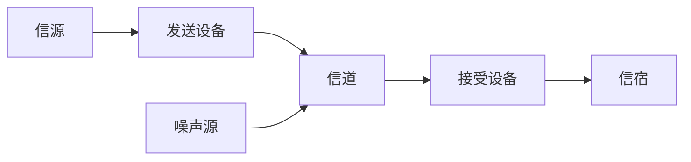

## 2. 物理层

### 2.1 通信概述

#### 通信系统

**信号**是数据的物理表现。**数字信号**取值离散。

1. **信源**将信息转化为原始信号；
2. **发送设备**通过变换、放大、滤波、编码、调制等方式，将原始信号转化为适合信道的信号；
3. **信道**是信号传输的物理媒介，给信号以通路的同时产生噪声和干扰；
4. **接受设备**通过放大、译码、解调等方式，恢复原始信号；
5. **信宿**把原始信号还原成信息。

**模拟通信系统**使用取值连续的**模拟信号**传输信息。

1. 信源将信息转化为原始电信号，称为**基带信号**，信宿将基带信号还原为信息；
2. 发送设备将基带信号**调制**为能在信道传输的已调信号，也称**带通信号**；
3. 接受设备将带通信号**解调**为基带信号。
4. 实际上，发送和接受还需要滤波、放大等变换，但不会使信号质变。

**数字通信系统**使用取值离散的**数字信号**传输信息，是现代通信技术的主流。

1. **信源编码**将信息转化为数字信号，信宿将数字信号还原为信息；
   - **码元**是数字信号的单位，二进制中只有0和1两种码元。
2. 发送设备对数字信号**加密**和**信道编码**，再**调制**为带通信号；
   1. 加密是为了信息安全；
   2. 信道编码加入保护成分，组成抗干扰编码，用于差错控制；
   3. 数字调制将信号的频谱转移到高频，形成带通信号。
3. 接受设备对带通信号进行**解调**，译码和解密，恢复数字信号；
4. 除此之外，还需要**同步**机制来维持收发端的时间同步。

数字通信的优点：抗干扰、差错可控、易于集成、易于加密、数字信号处理灵活。

#### 通信方式

**通信方式**指通信双方的工作方式。

1. 按信号传递，可分为单工、半双工、全双工通信。
   1. 单工通信：通信双方只有一个可以发送，另一个只能接收；
   2. 半双工通信：通信双方都可发送和接收，但不能同时发送和接收；
   3. 全双工通信：通信双方可同时发送和接收。
2. 数字通信按码元传输方式，可分为串行和并行传输。
   1. 串行传输：逐位按序传输
   2. 并行传输：若干位通过多个信道同时传输

#### 性能指标

**有效性**：

1. 单位时间传输码元数称为**码元传输速率**$R_B$，又称**波特率**，1波特（Baud）表示每秒1码元；
2. 单位时间传输二进制位数称为**信息传输速率**$R_b$，又称**比特率**；
3. M进制码元携带$\log_2M$位信息，因此$R_b=R_B\cdot\log_2M$。
4. 信道**带宽**$B$是信道能传输信号的频率范围，单位为$\mathrm{Hz}$。
5. 对数字通信系统，**频带利用率**表示单位带宽的传输速率，即$\eta=\frac{R_B}B$。

计算机网络中，**带宽**通常表示信道的**最高数据传输速率**。

**可靠性**：

1. **误码率**指错误接收的码元数占总码元数的比例；
2. **误信率**指错误接收的位数占总位数的比例，在二进制中，误码率和误信率相同。

### 2.2 信道

#### 无线信道

**无线信道**利用电磁波在空间中的传播来传输信号。

1. 约2MHz以下的低频电磁波趋于沿地面传播，称为**地波**，有一定绕射能力，能传播数百上千千米。
2. 2MHz～30MHz的高频电磁波能够被地面和电离层反射，称为**天波**，能传播上万千米。
3. 30MHz以上的电磁波能穿透电离层，只能进行**视线传播**。
   1. 为达成远距离通信，可以采用**无线电中继**或者利用**卫星通信**转发。
   2. **平流层通信**是用位于平流层的高空平台代替卫星的通信。
   3. 通过**电离层散射**、**对流层散射**、**流星余迹散射**也可达到通信效果。

#### 有线信道

传输电信号的有线信道主要有**明线**、**对称电缆**和**同轴电缆**。

1. 明线指电线杆上的架空线路，本身是裸线或带绝缘层导线，传输损耗低但噪声干扰大。
2. 对称电缆由若干对**双绞线**放在保护套内制成，
   1. 双绞线是两根以绞合的导线，绞合能减少各对导线间的干扰。
   2. 普通双绞线称为**非屏蔽双绞线**，UTP；
   3. 双绞线外加上一层金属丝编织的屏蔽层，称为**屏蔽双绞线**，STP。
   4. 对称电缆稳定但传输损耗高，常用于用户接入电路，网线就是对称电缆。
3. 同轴电缆由内外两根同心圆柱形导体构成，导体间和外导体外用绝缘体隔离。
   1. $50\Omega$同轴电缆常用于传送基带数字信号，早期局域网使用广泛。
   2. $75\Omega$同轴电缆常用于传送宽带信号，有线电视系统使用广泛。
   3. 外导体常用金属编织层，具有电屏蔽作用，抗干扰性强，可用于传送较高速率数据。

远距离有线信道通常使用**光纤**，光纤由低折射率的包层和高折射率的纤芯构成。

1. **多模光纤**：让多个角度入射的多条光线传输。光线在折射中逐渐展宽，造成失真，适用于近距离传输。
2. **单模光纤**：光纤的直径为光的波长，光线一直向前传播而不进行多次反射，适用于远距离。

#### 信道噪声

信道中存在的不需要的电信号统称**噪声**，按源头分为**人为噪声**和**自然噪声**。

1. 人为噪声由人类活动引发，例如电器产生的电磁波；
2. 自然噪声是自然存在的，包括电子热运动产生的**热噪声**，闪电、大气和来自宇宙的电磁波。
3. 热噪声是均匀分布的，且服从高斯分布，因此也称为**高斯白噪声**或**白噪声**。

噪声是叠加在信号上的，使模拟信号失真，使数字信号错码。按性质有以下三种：

1. **脉冲噪声**是突发噪声，幅度大但时间短；
2. **窄带噪声**是非所需的已调正弦波，例如经解调的热噪声；
3. **起伏噪声**是遍布在时域和频域的随机噪声，包括热噪声、宇宙噪声。

#### 信道特性

常称调制器和解调器之间的部分为**调制信道**，信道编码器和信道译码器之间的部分为**编码信道**。

1. 调制信道的输入$e_{in}(t)$输出$e_{out}(t)$可表示为$e_{out}(t)=f(e_{in}(t))+n(t)$，$n(t)$表示噪声；
2. 一般假设$f(e_{in}(t))=k(t)e_{in}(t)$，称$k(t)$为乘性干扰，$n(t)$为加性干扰；
3. $k(t)$表示信道特性，若它关于时间$t$变化，称信道为**时变信道**；
4. 若$k(t)$关于时间随机变化，称信道为**随参信道**，例如天波、地波、散射信道；
5. 若$k(t)$基本不随时间变化，称信道为**恒参信道**，各种有线和部分无线信道都可看作恒参信道。

恒参信道的特性通常可以用**振幅频率特性**和**相位频率特性**描述。信号不失真，需要特性和频率无关。

振幅频率特性不理想导致的信号失真称为**频率失真**，频率失真会引发波形畸变，导致相邻码元波形重叠，称为**码间串扰**。

相位频率特性不理想导致的信号失真称为**相位失真**，也会引发码间串扰。

#### 信道容量

**信道容量**是单位时间内能够传输的平均信息量最大值。

**奈奎斯特准则**：

在有限带宽$B$、没有噪声的信道中，为避免码间串扰，极限码元传输速率为$2B$。

**香农定理**：

有限带宽$B$、有限功率$S$、噪声$N$的高斯白噪声连续信道，信道容量$C=B\log_2(1+\frac SN)$。

$\frac SN$称为**信噪比**，是信号功率和噪声功率的比值。若用分贝为单位，值为$10\log_{10}\frac SN$dB。

#### 信道划分

1. **频分复用**，FDM：信道总频带划分为子频带，子频带作为子信道，相邻信道间有隔离频段。
2. **时分复用**，TDM：传输时间分为时间片，按时间片周期分配时间。
   - 统计时分复用，STDM：动态分配时间片。
3. **波分复用**，WDM：即光的频分复用，在一根光纤中传输不同波长光信号。
4. **码分复用**，CDM：用不同的编码来区分各路信号。既共享频率，也共享时间。

码分复用常称为**码分多址**，CDMA。

1. 原本发送1位的时间需要发送m位，每个位时间划分为m个短间隔，称为**码片**。
2. 每个信源都指派各自唯一的m位0/1序列，称为**码片序列**。
3. 将序列中的$0$用$-1$替代，序列$\{s_n\}$和$\{r_n\}$的**规格化内积**为$\frac1n\sum_{i=1}^ns_ir_i$；不同信源的**码片序列**的规格化内积为0。
4. 信源要发送1时，发送码片序列；要发送0时，发送码片序列的反码。
5. 信宿接受到m位序列后，与信源的码片序列作规格化内积，得到1就是1，得到-1转化为0。

### 2.3 调制和编码

调制就是把信号转化为适合在信道传输的信号的过程。

1. 通过调整波长，提高信号发送效率；
2. 迁移基带信号的频谱，提高信道利用率；
3. 扩展信号带宽，提高系统抗干扰能力。

调制的主要分类点，在于信号是模拟还是数字，载波是连续还是脉冲序列。

#### 模拟调制

调制信号是模拟信号的调制称为模拟调制，最常用的模拟调制是用正弦波为载波的幅度调制和角度调制。

**幅度调制**，线性调制：

1. 双边带调幅，简称调幅（Amplitude Modulation，AM），给基带信号$m(t)$叠加一个直流分量$A_0$，再与载波相乘，获得已调信号。即$s_{AM}(t)=[A_0+m(t)]\cos\omega t$。
   - AM信号波形的波峰平滑连线形成上下边带，与$A+m(t)$近似。
2. 不叠加直流分量，$m(t)$直接乘以载波，称为抑制双边带调幅（DSB），$s_{DSB}=m(t)\cos\omega t$。
   - DSB信号波形的上边带每次经过x轴反转的曲线和$m(t)$近似。
3. 仅需一边带即可完整传输信息，将一边过滤掉的调制称为单边带调制（SSB）。
4. 不完全抑制一个边带，而是保留一部分，称为残留边带调制（VSB）。
5. 解调：
   1. 乘以一个**相干载波**，如果是AM，需要再加一个隔直流电容。
   2. 也可以直接用整流器和滤波器提取信号，称为**包络检波法**。

**角度调制**，非线性调制：

1. 频率调制（FM）：调制频率。
2. 相位调制（PM）：调制相位。

#### 数字调制

把数字基带信号变换为数字带通信号的调制称为数字调制，参考模拟调制的调幅、调频、调相，数字调制有**振幅键控**（ASK）、**频移键控**（FSK）和**相移键控**（PSK）。二进制的键控，简写为2ASK、2FSK、2PSK。

1. 2ASK中，用两种振幅表示0和1，例如，有振幅表示1，无振幅表示0。
2. 2FSK中，用两种频率表示0和1。
3. 2PSK中，用两种相位表示0和1。

**正交振幅调制**（QAM）是振幅和相位联合的键控。用m个相位，n个振幅，可以表示mn种信号状态，例如QAM-16使用4个振幅和4个相位来表示16种信号状态。

#### 数字编码

常用数字信号编码：

1. 归零编码，RZ：高电平表示1，低电平表示0，每个码元中间跳变到0电平。
2. 非归零编码，NRZ：不归零，每个周期内全是高电平或低电平。
3. 反向非归零编码，NRZI：用电平的跳变表示0，不变表示1。
4. 曼切斯特编码：每个码元中间都跳变，从高到低表示1，从低到高表示0。
5. 差分曼切斯特编码：每个码元中间都跳变作为时钟信号，码元开始处跳变为0。

将模拟信号调制为数字信号，通常经过**采样**、**量化**和**编码**：

1. 周期采样模拟信号得到离散信号。采样频率不低于信号频率2倍。
2. 将离散信号按阈值取整，量化为固定分级。
3. 将量化后的值转化为数字编码。

### 2.4 物理层设备

物理层确定的接口的特性：

1. 机械特性：接口所用接线器的形状、尺寸、引脚数目和排列、固定和锁定装置等。
2. 电气特性：接口电缆的各条线的电压范围、传输速率和距离限制。
3. 功能特性：某条线上某一电平的意义、每条线的功能。
4. 过程特性：不同功能的可能事件的顺序。

**中继器**：整形、放大并转发信号。

1. 原理是信号的再生，而不是简单的放大。
2. 不能连接两个具有不同速率的局域网，使用中继器连接的几个网段仍是一个局域网。
3. 5-4-3规则：在采用粗同轴电缆的10BASE5以太网标准中，互相串联的中继器不超过4个，并且4个中继器串联的5段通信介质中，只有3段可以挂接计算机。

**集线器**：一个多端口的中继器。

1. 由集线器组成的网络是共享式的，逻辑上是总线形网络。
2. 集线器将收到的帧转发到其他所有接口。